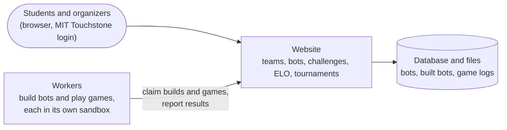

# scrimmage

The MIT Pokerbots scrimmage server. Teams upload bots and challenge each other
on an ELO ladder, and the organizers run round-robin tournaments. Every bot is
built once when it's uploaded, and every game runs in a locked-down sandbox.
Released under the MIT License.

- [How it works](#how-it-works)
- [For competitors: bot format and limits](#for-competitors-bot-format-and-limits)
- [Security and fairness](#security-and-fairness)
- [Development](#development)

Deploying and operating the server is covered in the organizers' private
operations guide; ask the Pokerbots team.

## How it works



A bot's life, from upload to results:

```mermaid
sequenceDiagram
    participant Team as Team (browser)
    participant Site as Website
    participant Worker as A worker
    participant Box as Sandbox container

    Team->>Site: upload bot.zip
    Worker->>Site: claim the build
    Worker->>Box: run commands.json "build" once<br/>(only this bot, no network)
    Box-->>Worker: built bot + build log
    Worker->>Site: upload them
    Note over Site: bot is "built" and becomes current
    Team->>Site: challenge another team
    Worker->>Site: claim the game
    Worker->>Box: engine + both built bots<br/>(the game's own cores, no network)
    Box-->>Worker: scores, logs, per-bot stats
    Worker->>Site: report the result
    Note over Site: ELO updated
    Team->>Site: read the result and logs
```

If a worker stops mid-job, the build or game goes back to the queue and runs
elsewhere. Nothing is lost.

## For competitors: bot format and limits

Upload a `.zip` of your bot (up to 100 MB). At its top level (or one folder
down) there must be a `commands.json` with two commands:

```json
{ "build": ["javac", "javabot/Player.java"], "run": ["java", "javabot.Player"] }
```

- **`build` runs once, right after you upload.** Whatever it leaves in your
  bot's directory is your bot. The team page shows "building", then "built"
  (the bot becomes your current bot) or "failed" with the build log; a failed
  build leaves your previous bot in place. It may be `[]`.
- **`run` starts your bot for each game**, with the engine's port appended.
  It runs on what `build` produced.

Each is a command, not a shell line. For several steps, use a script or
`["bash", "-c", "..."]`, and end shell scripts with `set -e` so a failed step
fails the build. Any pipeline works as long as it runs offline:

| Bot | `build` | `run` |
|---|---|---|
| Python | `[]` | `["python3", "player.py"]` |
| Python with Cython | `["python3", "setup.py", "build_ext", "--inplace"]` | `["python3", "player.py"]` |
| Python with extra packages | `["pip", "install", "--no-index", "--find-links", "wheels", "--target", "deps", "-r", "requirements.txt"]`, with the wheels in your zip (`pip download -d wheels --platform manylinux2014_aarch64 --python-version 3.13 --only-binary=:all: -r requirements.txt`) | `["env", "PYTHONPATH=deps", "python3", "player.py"]` |
| C++ (CMake) | `["bash", "build.sh"]` (`cmake -S . -B build -DCMAKE_BUILD_TYPE=Release && cmake --build build -j "$SCRIMMAGE_CORES"`) | `["./build/pokerbot"]` |
| Java | `["javac", "-d", "out", "javabot/Player.java"]` | `["java", "-cp", "out", "javabot.Player"]` |
| Rust, Go, anything else | build on your machine for Linux arm64 (aarch64) and ship the binary | `["./mybot"]` |
| A trained model | `[]` (ship the weights) | `["python3", "player.py"]` (inference on CPU) |

The build runs on the same kind of machine as your games (arm64), in the same
sandbox, with no network, 4 cores
(or fewer), 4 GB of memory, and a 10-minute limit. Your bot
lives at the same path in the build and in every game, so absolute paths a
build writes keep working.

Games run without network access, on 1, 2, 4 or 8 cores of an AWS Graviton4
(Arm Neoverse V2, 2.8 GHz, 64-bit Arm/aarch64), as the organizers choose for
the season or a tournament, with 1.5 GB of memory per core. Your bot is
paused while your opponent thinks, so all of its cores are yours on your turn.
On multi-core games, `SCRIMMAGE_CORES` gives your core count, and
`OMP_NUM_THREADS`, `MKL_NUM_THREADS`, `OPENBLAS_NUM_THREADS`, and Java's
processor count are set to match. More cores means more work per second, not
more seconds. Keep worker threads or processes alive between turns rather
than starting them each time; in Python, use processes (`multiprocessing`,
`concurrent.futures.ProcessPoolExecutor`) or libraries that release the GIL
(numpy, torch).

The software: Python 3.13 (numpy, scipy, pandas, scikit-learn, PyTorch and
TensorFlow on CPU, Cython, gensim, nltk, pkrbot), GCC/G++ 14, CMake, Boost,
and OpenJDK 21, on Debian 13 (arm64).

The defaults:

| Limit (per bot) | Value |
|---|---|
| CPU | the game's cores (1 by default); your bot is paused while your opponent thinks, so all cores are yours on your turn. `SCRIMMAGE_CORES` and `OMP_NUM_THREADS` say how many. |
| Memory | 1.5 GB per core: your processes' memory (shared pages of forked workers count once) plus files you write anywhere |
| Processes and threads | 256 |
| Thinking time | the game clock (default 60 s per game) |
| Connect time | 10 s after starting, by default |
| Output kept | 512 KB per game by default |
| Scratch space | your home directory and `$TMPDIR`, plus `/tmp` and `/dev/shm` (shared with your opponent, but your files there are private to you and count toward your memory) |

A bot that exceeds a limit, crashes, or stalls is disconnected. It forfeits the
rest of the game (check/fold), and its opponent is unaffected. You see the game
log, your own bot's output, and the engine log, never your opponent's output.

## Security and fairness

**Accounts and access.**
- Only MIT Touchstone accounts can log in; admin pages are invisible to
  everyone else.
- Forms are CSRF-protected, cookies are HTTPS-only, and SQL is parameterized.
- Teams can see only their own bots and bot output.
- On the server, the website and the match worker run as separate users. Only
  the worker can use Docker, and it can't read the database.
- Workers talk to the site only through a token-protected private API. A worker can fetch only the bots of games it holds, and the server
  rejects results that aren't zero-sum or that come from a worker that no
  longer holds the game.
- Only the organizers can open a shell on the servers.

**Builds.** Old scrimmage servers ran each bot's own build script inside
every game, next to the opponent, so a build script could read the opponent's
code. Here a build runs once, in its own container, before any game: its
sandbox holds nothing but that bot, with the same limits as a game and no
network. Games only start already-built bots, and the worker unpacks a built
bot only after checking it is the exact archive the build produced (SHA-256)
and that nothing in it points outside the bot's directory. A worker can
download a bot's source only while it holds that bot's build.

**Inside a game.** Each game runs in a container with:
- no network;
- a read-only root filesystem and no extra privileges for the bots (the
  runner inside keeps the few root capabilities it needs to switch users and
  measure the bots' memory; bots run as other users, which drops them all);
- its own pinned cores and a hard memory cap.

The stock engine runs inside, wrapped by `game/run_match.py`:
- Each bot has its own user and private home, so it can't read, signal, or trace
  its opponent.
- Only the right bot can connect to each engine port.
- The waiting bot is frozen while the other thinks.
- Each bot has its own process and memory budget, counting the files it puts
  in the shared `/tmp` and `/dev/shm`, so fork bombs, memory hogs, and bots
  that fill shared space lose their own game. If the container itself ever
  runs out of memory, the kernel kills bot processes before the engine.
- Nothing a bot does can stall or crash the engine, so a loss can't be turned
  into an unrated error.
- Both bots in a game get identical limits on identical hardware, and every
  worker machine is the same type.
- The deck is shuffled with OS-seeded randomness that bots can't observe.

Each of these has an adversarial test in `tests/test_docker.py`.

## Development

To try it on your laptop (needs [uv](https://docs.astral.sh/uv/) and Docker):

```sh
uv sync
docker build -t scrimmage-game:latest game/          # ~10 minutes the first time
AUTH_MODE=dev ADMINS=yourkerb uv run scrimmage dev   # http://localhost:8000
```

Log in as any kerberos (dev mode has no passwords), create a team, and upload a
zip of `tests/fixtures/bots/python`. Log in as someone else in a private window,
make a second team, upload again, and challenge the first team.

```
scrimmage/
  web/            website (Flask views + templates) and worker_api.py
  services/       the rules: accounts, bots, builds, matches (challenges), queue
                  (leases, results), tournaments, ratings, fleet (capacity),
                  hardware (cores per game)
  worker/         the match worker: API client, Docker sandbox, bot cache
  db.py, schema/  SQLite access and migrations (applied automatically)
  archive.py      backups;  bake.py  pre-built worker machine images
  settings.py     admin-editable settings;  config.py  environment config
  cli.py          the `scrimmage` command
game/             the match image: engine.py (stock), run_match.py (the sandbox inside)
deploy/           server installers and configuration
tests/            fast tests, plus real-Docker match tests (including hostile bots)
```

```sh
uv run pytest                    # fast tests
uv run pytest -m docker          # real matches in the game image
uv run ruff check . && uv run mypy
docker run --rm -v "$PWD:/src:ro" ubuntu:24.04 bash /src/deploy/test-deploy.sh   # installer + Apache + Shibboleth
```

**New season's engine:**
1. Replace `game/engine.py`. Leave it unmodified.
2. Check that `game/config_template.py` defines every config name it reads.
3. Update the bot libraries in `game/pyproject.toml` and run `uv lock` there.
4. If the final log line changes from `Final, A (n), B (m)`, update
   `parse_scores` in `services/queue.py`.
5. Replace `tests/fixtures/bots/` with the new skeletons and run
   `uv run pytest -m docker`.
6. Deploy it (see the organizers' operations guide).
